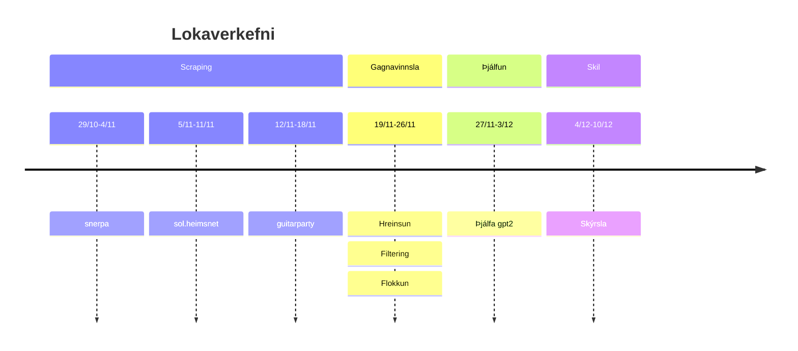

# inngangur

## kynning

Daginn,
ég heiti Tumi og ætla kynna lokaverkefnið mitt í "Inngang að Máltækni" áfanganum við Háskóla Íslands.

Ég hef alltaf haft mikinn áhuga á tónlist og hef verið í nokkrum hljómsveitum sem gengið hefur misvel.
Tölvur eru annað stórt áhugamál hjá mér og þegar ég fattaði að ég gæti blandað þessum tveimur áhugamálum saman í eitt verkefni þá skellti ég mér strax í það.

Það mætti segja að þetta verkefni hafi verið í þróun síðan í fyrstu vikum þessa námskeiðs.

Ef við lítum til baka á fyrsta verkefnið sem við vorum látin gera, að útbúa einfaldan tokenizer, eða "Tóka" að ég held fyrir íslensku pjúristana þarna úti.

Við áttum síðan að taka þenna tóka og keyra í gegnum hann texta af eigin vali, ég ákvað að vinna mér inn nokkur rokkstig með því að nýta íslenskan texta og þar sem ég elska tónlist, ákvað ég að taka íslensk dægurlög.

Ég komst þó fljótt að því að þetta gæti orðið stærra verkefni en ég bjóst við.

Það er vegna þess að það eru engin almennileg samansöfn af íslenskum textum á netinu.
Það væri þá helst guitarparty eða snerpa.is en mér leist ekkert á þau þar sem vinnan sem færi í að ná í textana væri alltof mikil fyrir fyrsta heimaverkefnið.

Ég leitaði þó aðeins betur og fann eftir stutta leit sól.heimnet.is, þetta var nákvæmlega það sem ég var að leita að.
Fullt af textum á einni langri síðu sem ég gat bara copy past-að inn í skjalið mitt og keyrt í gegnum tókann.
Eftir þetta gekk verkefnið bara býsna vel og ég gat gert næstu skref án vandræða en það sat þó aðeins í mér, það vantar almennilegt gagnasafn af íslenskum textum á netið.

Þá fyrst snertum við á lokaverkefninu sjálfu.
Að búa til gagnasafn af íslenskum textum sem hægt væri að nota til að þjálfa NLP módel.

# vinna

Ég byrjaði á að setja fram þetta plan, þetta átti ekki að vera of flókið, scrape-a smá texta af netinu og snyrta aðeins til að passa sem þjálfunargögn, hljómar einfalt

RANGT

## 29/10 - 5/11 - snerpa.is

Fyrsta fórnalamb mitt í þessu verkefni var snerpa.is. 
Síðan leit vel út, ágætlega skipulög, vel uppsett og með HTML sem meikaði sens.
Ég ákvað, þar sem mest af minni forritunarkunnáttu liggur í vefforritun, að nota javascript til að fá lista af öllum undirsíðum snerpu sem innihélt lagatexta.
Heppilega innihélt lendingarsíðna fyrir textasafnið þeirra linka á allar undirsíðurnar svo þetta var hægt að útfæra á örskotsstundu.

Eftir að hafa útbúið þennan lista af síðum ákvað ég að prófa að nota *beautiful soup* pakkann í python í fyrsta skipti.
Eftir að hafa "lesið" dokkurnar, þá tókst mér að skrapa síðuna frekar hratt og fyrsta skref í planinu var komið.

## 6/11 - 19/11 - sól.heimsnet.is

Eftir góða og hraða vinnu við snerpu.is reiknaði ég með að næstu síður yrðu svipað auðveldar, ég meina sól.heimsnet hafði ég meira að segja unnið með áður.

Þrátt fyrir að helmingur tímans sem ég gaf mér til að vinna verkefnið hafi átt að fara í að skrapa vefinn, þá þurfti ég samt nokkra auka daga af vinnu bara fyrir þessa síðu. Það má leiða það bæði til vondrar uppsetningar á HTML-i síðunar og hroka í mér :)

Ef við skoðum aðeins HTML-ið sem ég var að sækja þá má sjá að skipulagið fylgir ekki endilega bestu venjum við vefforritun.
Upphaflega reyndi ég að nota *beautiful soup* pakkann til að vinna úr þessari súpu þar sem hann virkaði svo vel á snerpu, en ég endaði einfaldlega á að nýta mér frábæru skipanirnar `<Ctrl-C>` og `p` og mjög mikla handavinnu í vim,

já ég nota vim,

til þess að vinna úr gögnunum.
Í heildina, eftir að hafa skipt yfir í handavinnuna tók þetta ekki nema um helgi til að vinna úr, þess má geta að laugardagurinn hefði geta verið nýttur betur en ég kenni föstudeginum um það.

## 20/11 - 27/11 - guitarparty

Nú var ég kominn slatta á eftir áætlun og var búinn að dýfa tánum í að þjálfa GPT2 á þeim gögnum sem ég var kominn með og niðurstöðurnar voru, ekkert sérstakar en þó eitthvað.

Þessvegna var ég ekki mjög spenntur að sjá þegar ég opnaði guitarparty þetta HTML.
Ég meina jesús kristur, hvernig gerist þetta einu sinni.
Ég íhugaði að gefast upp á þeim eftir vesenið sem ég lennti í með heimsnet en fyrir slysni rambaði ég inn á network tabið hjá þeim og viti menn, opinn API.

Það fyrsta sem ég athugaði, er hægt að flokka eftir tungumálum

nei

ok, er hægt að fá texta án hljómanna

nei

ok, er hægt að skoða alla skráða notendur á þjónustunni?

já, en skiptir ekki máli??

Nú hafði ég tvö vandamál til að leysa
1. Fá yfirlit yfir öll íslensku lögin sem guitarparty hafði í höndum sér
2. Ná hljómunum út úr textanum

Fyrsta vandamálikð tók smá tíma, ekki vegna þess að það var mjög flókið, nei vegna þess að APINN hleypti aðeins í gegn max 10 lögum í einu þegar verið var að sækja svona mikið af gögnum. Þess má geta að ég þurfti að sækja og skoða 18600 lög.

Með skraparanum mínum gat ég sótt ca eina síðu sem innihélt 10 lög á sekúndu eða tveimur, tökum meðaltalið og segjum 1.5 sekúnda á hver 10 lög. fyrir 18600 lög þá gerði þetta $\frac{18600}{10}*1.5 = 2790$ sek eða í kringum 47 mínútur, eingöngu til að fá lista af lögum til að vinna úr.
Svo má náttúrulega ekki gleyma tímanum sem fór í keyrslur sem krössuðu eða klikkuðu á einhverja vegu, en til að gera langa sögu stutta þá tók það langan tíma að fá yfirlit yfir íslensku lögin.

Að vinna úr gögnunm gekk þó aðeins betur.
Nú hafði ég ágætis lista yfir þau lög sem ég ætlaði að sækja, þau voru um 3300, og til að vinna úr þeim þurfti bara smá python töfra með dassi af RegEx.
Ég er mjög ánægður núna að hafa ráðist í að fá þessi gögn því heildar lagafjöldinn jókst um meira en þrefalt nánast fjórfalt.

## 28/11 - 4/12 - GPT2, próf og panik

Nú var megnið að verkefninu komið og tók ekki nema fjórar vikur :anguished:
En þá var komið að því að athuga hvort gögnin mín gætu verið notuð til að fínþjálfa GPT2 til að spíta út íslenskum lagatextum.

Ég notaði GPT2-igc-is módelið frá Jóni Friðrik Daðasyni sem grunn og fylgdi síðan frábæru tutorial frá Phil Schmid um hvernig ætti að fínþjálfa svona líkan sem generative model.

Þjálfunin gekk pínu brösulega fyrir sig og ég þurfti að keyra mikið á colab og fikta og keyra og fikta og keyra en að lokum hafði ég í höndum version 0.0.

Það var algjör lámarksútfærsla með 2 epoch og flesta hyperparametrana aðra lága líka. Mig langaði að hækka þá flesta og keyra þannig en þá hefði ég þurft að brikka tölvuna sem ég var að nota til að læra fyrir próf.
Hvað gera bændur í því.

Ég gróf upp gömlu og áreiðanlegu Arch vélina mína

já ég nota Arch

og keyrði nýju hyperparametrana með 5 epochum og hún sprakk ekki húrra, það tók bara 14 klst til að klárast en aðalatriðið var að það tókst.

Næst var að taka þetta einu skrefi lengra, vera með háu hyperparametrana og 16 epoch og viti menn, henni tókst það.

Ég sett allar útgáfur módelsins á huggingface sem private því ég veit ekki hversu strangar höfundarréttarreglur eru með svona dót en þetta virkaði allt.

# outro

Í heildina endaði ég með 3920 lög, 126.000 lína json skrá og rosalega virðingu fyrir öllum þessum nýju stóru tungmódelum.